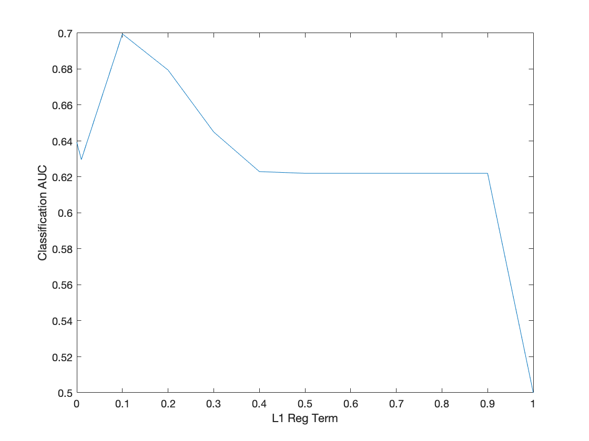

# Vanilla Logistic Regression

In `logistic_train.py`, I implemented a basic logistic regression model using gradinet descent. In the table below we explored the affect of training the model on various sizes of data from 200 to 2000 examples. We can see that the final test accuracy is only sightly affected. This indicates that only a small amount of data is needed in this domain to find a well-fitting model.

| n    | Accuracy |
| ---- | -------- |
| 200  | 92.54%   |
| 500  | 93.23%   |
| 800  | 93.04%   |
| 1000 | 93.04%   |
| 1500 | 93.69%   |
| 2000 | 93.85%   |

# L1-Regularized Logistic Regression

Using the provide Logistic Regression code, we explored the affect of varying the regularization penalty for the L1 regression. Because the prediction performance depends on the classification threshold we set, we measure the AUC of the precision/recall curve rather than classification accuracy.

From the plot we can see that a penalty of 0.1 is ideal for this domain, and the performance drops off once we inforce too much sparcity and the weights become 0.